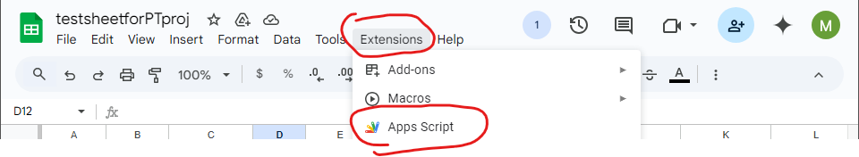
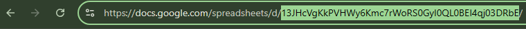
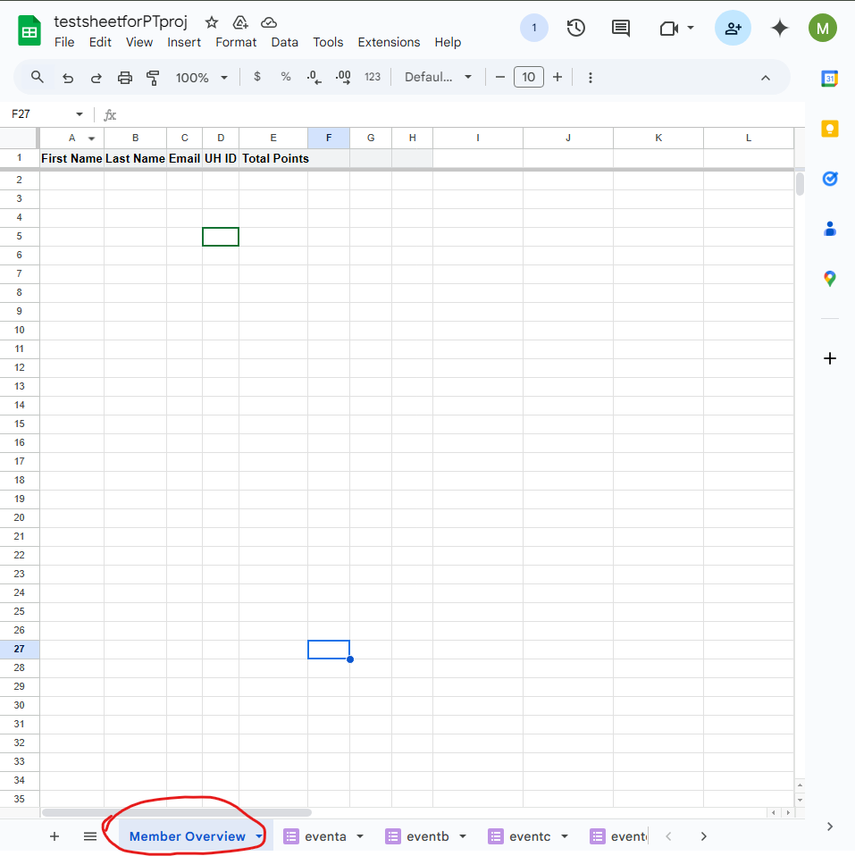
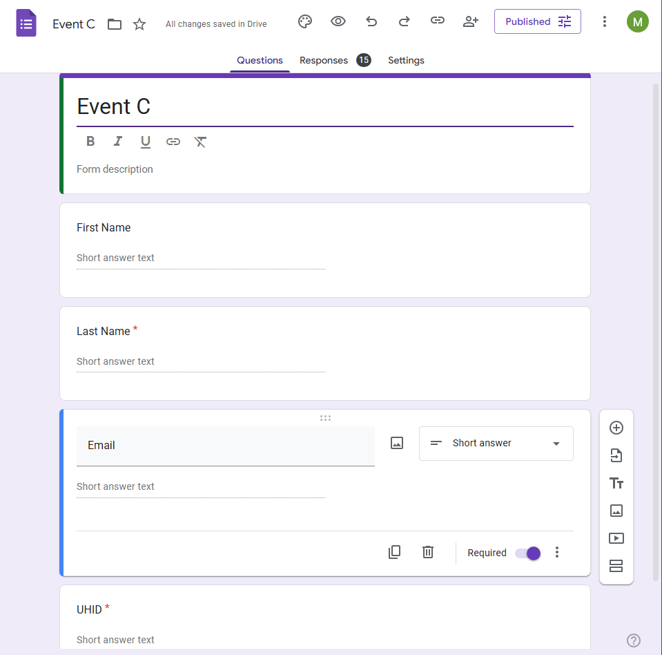
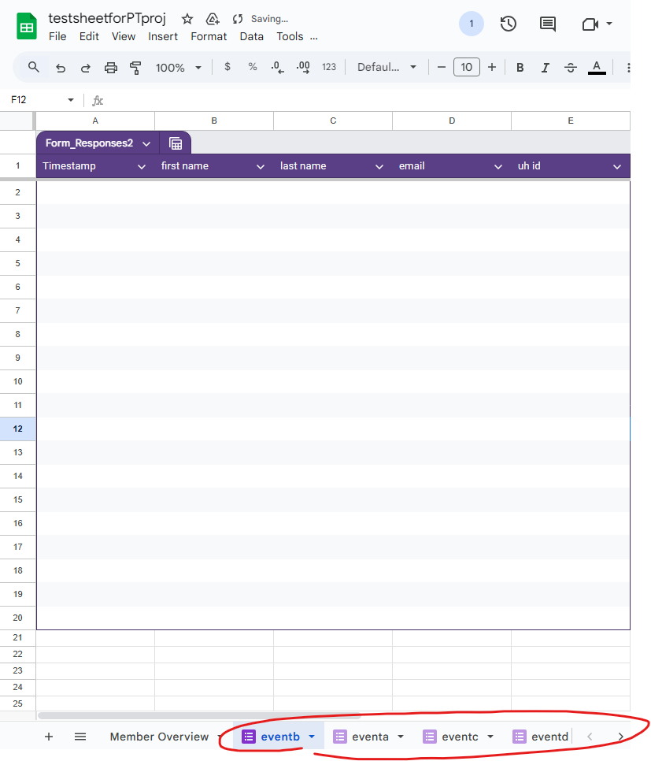

# Google Sheets Membership Points Tracker

This project is an automated solution for tracking and updating membership points for users based on Google Form submissions. It is designed to manage multiple Google Forms linked to a single Google Sheet and consolidate the responses into a centralized main tracking sheet. The script ensures accurate point tracking, avoids duplicate entries, and allows for dynamic updates to membership statuses.

## Features

- **Automatic Data Retrieval**: Extracts form responses from the last submitted row.
- **Points Tracking**: Updates the main sheet with points for each participant.
- **New User Handling**: Adds a new row if a user is not already listed.
- **Duplicate Prevention**: Ensures multiple submissions for the same event do not give extra points.
- **Name Normalization**: Converts names to lowercase and trims whitespace for consistency.
- **Points Via ID**: Handles the points via ID so that name dupes between users doesn't cause errors.

## How It Works

1. A Google Form is created for each event and linked to a spreadsheet.
2. The script extracts the latest form response from the Google Sheet.
3. It checks if the participant is already in the main sheet:
   - If found, their points are incremented.
   - If not, a new row is created with their details.
4. Name standardization prevents case-sensitive duplicates.
5. A separate script may be needed to track users’ event attendance over time.

## Initial Setup

1. **Create a Google Spreadsheet**
2. **Link Google Spreadsheet to google scripts**
   
3. **Copy and paste the script** into the Google Apps Script Editor.
4. **Modify the following variables**:
   - spreadsheetId: change this to YOUR google spreadsheet ID, it can be found in the URL. (image below for reference)
     
   - targetSheetName: this should be changed to the name of your main 'subsheet' or 'tab' in which all member data will get funneled to. (image below for reference)
     
5. **Set up a trigger on Google Appscript**
   - a. Go Into Trigger
   - b. Add Trigger
   - See image below for how it should look
     

## Adding 'Events'

1. **Create a Google Form** for an event. The form MUST include the following variables in EXACT ORDER BELOW

   - 1. First Name
   - 2. Last Name
   - 3. Email
   - 4. ID - See image below for how it should look
        

2. **Link the Form to the Google Sheet Created in 'Initial Setup'** (Responses are automatically recorded to google sheet).
   
   - This will create a subsheet at the bottom of your page with the event name. This name can be changed on the spreadsheet if wanted, but it will also affect the script
     
3. **Adjust Event Name in Script**
   - you must go into the appscript connected to your spreadsheet and change the variable 'sourceSheetName' to EXACTLY how your event name appears at the bottom of your spreadsheet.
4. **Adjust Point Value for Attending Event**
   - You must go into the appscript connected to your spreadsheet and change the variable 'pointsForThisEvent' to how many points the event is worth

## Important Takeaways

The following variables should be well tracked:

- spreadsheetID
- sourceSheetName
- targetSheetName
- pointForThisEvent

All steps should be well accounted for, as the program is in its beginner stages, certain things could cause the code to not work as desired.

## Other Notes

- The script is currently designed to accommodate the basic Google Form structure provided, which retrieves the name, email, and membership status of each member and consolidates this information into the main sheet.
- Additional coding may be required to handle more complex forms or additional data fields not included in the current setup.
