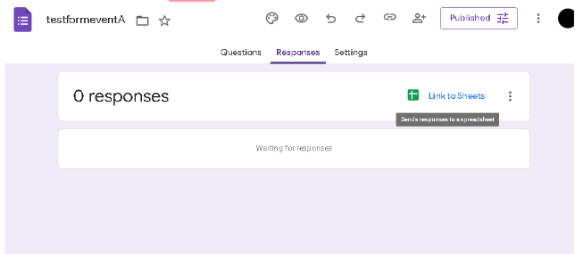
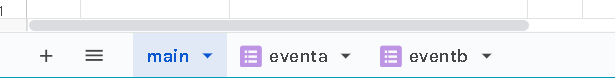
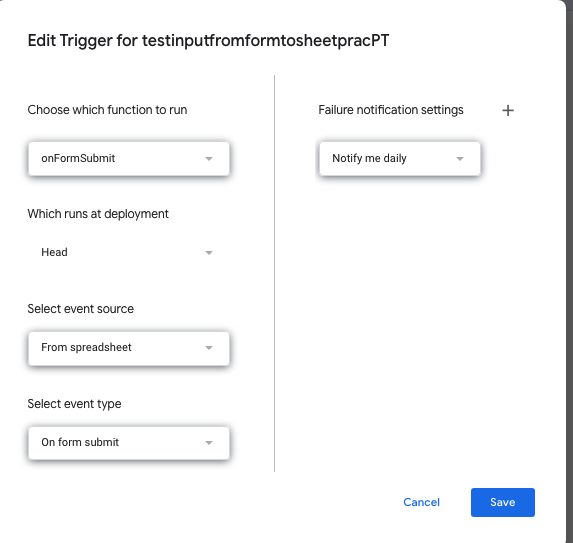

# Google Sheets Membership Points Tracker

This script automates tracking and updating membership points for users based on Google Form submissions. It retrieves form data, updates the main tracking sheet, and ensures duplicate entries do not add extra points. 

## Features

- **Automatic Data Retrieval**: Extracts form responses from the last submitted row.
- **Points Tracking**: Updates the main sheet with points for each participant.
- **New User Handling**: Adds a new row if a user is not already listed.
- **Duplicate Prevention**: Ensures multiple submissions for the same event do not give extra points.
- **Name Normalization**: Converts names to lowercase and trims whitespace for consistency.

## How It Works

1. A Google Form is created for each event.
2. The script extracts the latest form response from the Google Sheet.
3. It checks if the participant is already in the main sheet:
   - If found, their points are incremented.
   - If not, a new row is created with their details.
4. Name standardization prevents case-sensitive duplicates.
5. A separate script may be needed to track users’ event attendance over time.

## Setup Instructions

1. **Create a Google Form** for an event.
2. **Link the Form to a Google Sheet** (Responses are automatically recorded).

    **Keep track of the name of the sheet (created when linking from Google Form) -- You are able to change, but make sure to change the variable in the code as well**
3. **Copy and paste the script** into the Google Apps Script Editor.
4. **Modify the following variables in the script**:

   - `sourceSheet`: The name of the sheet containing form responses.
    **This is the name of the sheet for the corresponding Google Form** 
   - `eventName`: The name of the event (used to track attendance).
        **This is what is shown up on the 'main' Google Sheet** 
5. **Set up a trigger on Google Appscript**
    - a. Go Into Trigger
    - b. Add Trigger
    - See image below for how it should look

## Other Notes
**May have to make small tweak to code if the sheet you want to put the data onto (from the Google Form output) is not called 'main'** 
